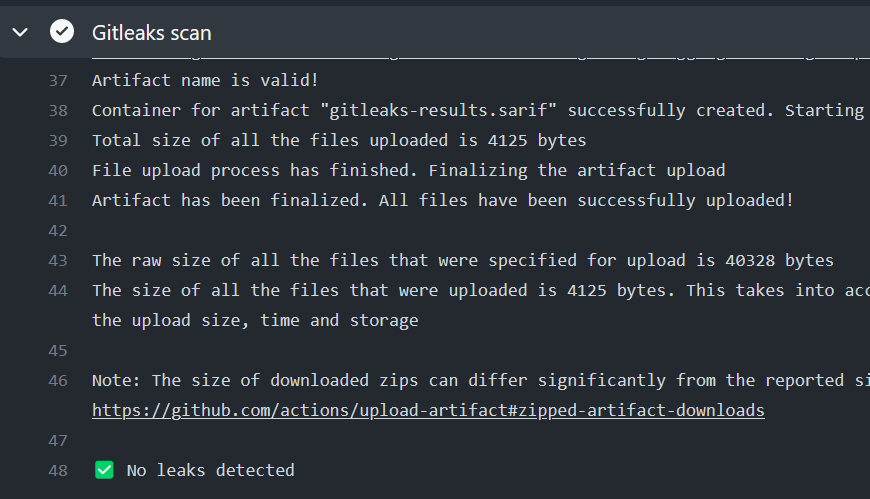
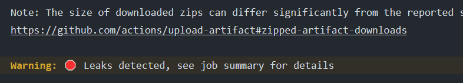
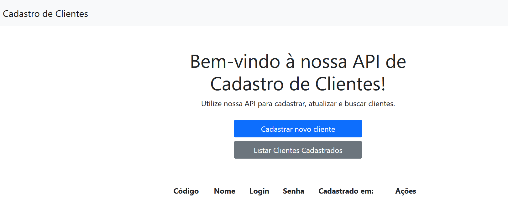

# API Rest com Spring Boot - Cadastro de Usuários

Este projeto é uma API Rest construída com Java e Spring Boot para realizar o cadastro de usuários em um banco de dados H2. 
Ele utiliza as melhores práticas de desenvolvimento para garantir alta qualidade de código e escalabilidade.

### Funcionalidades

As seguintes funcionalidades estão atualmente em construção:

- Cadastrar usuários.
- Listar todos os usuários.
- Listar usuários por código/ID.
- Deletar usuários por ID.
- Página web com função de cadastrar, listar e deletar usuários.

### Tecnologias utilizadas

As tecnologias utilizadas neste projeto incluem:

- Spring Boot
- Banco de dados H2 (dados salvos na memória)
- Java 
- HTML/CSS/JS (bootstrap/jquery)

### Como executar o projeto

Para executar este projeto, é necessário ter o Java 11 instalado em sua máquina. 
Em seguida, basta seguir as seguintes etapas:

- Clone o repositório em sua máquina local.
- Navegue até a pasta do projeto e execute o comando mvn spring-boot:run no terminal.
- Acesse a página inicial em seu navegador em http://localhost:8080/.

O projeto também pode ser executado em uma IDE como Eclipse ou IntelliJ, utilizando as mesmas etapas acima.

### Gitleaks - Segurança de chaves e segredos

Foi incluido no build.yml uma entrada para a ferramenta Gitleaks, que faz uma varredura no código afim de encontrar dados sensiveis como senhas, secrets e keys que não deveriam estar expostos, mas por algum motivo estão.
Essa ferramenta faz a busac em todo o repositório e por fim barra o build se houver algum dado sensivel exposto.

#### Gitleaks SEM dados expostos

#### Gitleaks COM dados expostos
 
### Hospedagem

Este projeto está hospedado no Heroku e pode ser acessado através do seguinte link:

 https://apirestcadastro.herokuapp.com/

### Contribuição

Este é um projeto para estudos e está em construção.  
Caso encontre um bug ou tenha alguma sugestão de melhoria, por favor abra uma issue ou submeta um pull request.

